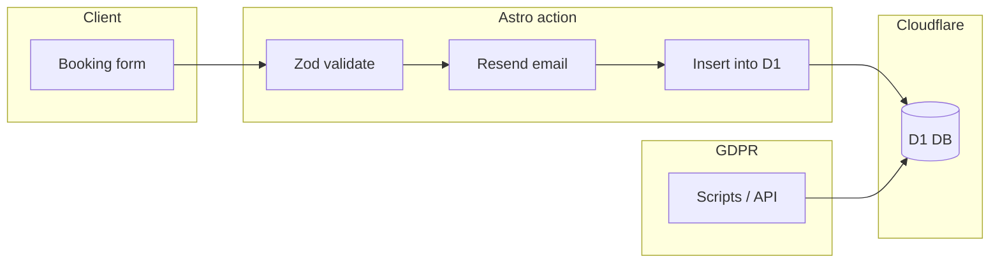

# D1 database and GDPR for booking submissions

## Current state

- **App:** Astro with `@astrojs/cloudflare`, server output; booking action in [apps/web/src/actions/index.ts](apps/web/src/actions/index.ts) validates with Zod and sends email via Resend only (no DB).
- **Wrangler:** [apps/web/wrangler.jsonc](apps/web/wrangler.jsonc) has `main`, `name`, `compatibility_*`, `assets`, `observability`; no D1 or other bindings yet.
- **Booking payload:** Name, contactMethod, contactDetail, address, service, preferredTime, notes, otherPreferences, sensory (see [apps/web/src/components/booking/types.ts](apps/web/src/components/booking/types.ts) and action schema).

## 1. D1 database and wrangler config

- **Create the database** (one-time, manual step):
  - From `apps/web`: `wrangler d1 create lucy-hair-db` (or chosen name).
  - Copy the returned `database_id` (UUID) into wrangler config.
- **Add D1 binding in [apps/web/wrangler.jsonc](apps/web/wrangler.jsonc):**
  - Add a `d1_databases` array with one entry:
    - `binding`: `"DB"` (used in code as `context.locals.runtime.env.DB`).
    - `database_name`: e.g. `"lucy-hair-db"`.
    - `database_id`: the UUID from `wrangler d1 create`.
    - Optional: `migrations_dir`: e.g. `"migrations"` so migrations live under `apps/web/migrations/`.
  - Add a short comment in wrangler that this DB is used for booking submissions and for GDPR export/erasure (see docs).
- **Types:** Run `wrangler types` (from `apps/web`) so generated `Env` includes `DB`. Use that `Env` for Astro runtime typing (see below).

## 2. Schema and migrations

- **Table:** One table is enough, e.g. `booking_submissions`:
  - `id` INTEGER PRIMARY KEY AUTOINCREMENT (or use a generated UUID if preferred).
  - `created_at` TEXT (ISO timestamp) or INTEGER (unix).
  - Columns matching the form: `name`, `contact_method`, `contact_detail`, `address`, `service`, `preferred_time`, `notes`, `other_preferences`, and a JSON column for `sensory` (e.g. `sensory_json`).
  - Index on `contact_detail` to speed up GDPR lookups by email/phone.
- **Migrations workflow:**
  - Create: `wrangler d1 migrations create lucy-hair-db init` (or a descriptive name) in `apps/web`, then add the `CREATE TABLE` and `CREATE INDEX` SQL in the generated file.
  - Apply locally: `wrangler d1 migrations apply lucy-hair-db --local`.
  - Apply remote: `wrangler d1 migrations apply lucy-hair-db` (e.g. in CI or before deploy).

## 3. Astro action: persist to D1

- **File:** [apps/web/src/actions/index.ts](apps/web/src/actions/index.ts).
- **Handler signature:** Change the `send` action handler to accept the second parameter: `handler: async (input, context) => { ... }`. The action already uses the same input schema; no client change needed.
- **Access D1:** After sending the email (and after any future Turnstile/rate-limit steps), read the binding:
  - `const db = context.locals?.runtime?.env?.DB;`
  - If `db` is present, run a parameterized `INSERT` into `booking_submissions` with the validated fields (omit any `turnstileToken` if added later). Use `input` already validated by Zod; store `sensory` as `JSON.stringify(input.sensory)`.
  - If `db` is absent (e.g. local dev without D1), skip the insert and still return success so the email-only path keeps working.
- **Error handling:** If the insert fails, consider whether to throw (and surface to user) or only log and still return success so the email is already sent. Recommendation: log and return success to avoid double-submissions; fix data issues separately.

## 4. TypeScript: runtime and D1

- **Env and Locals:** So that `context.locals.runtime.env.DB` is typed, extend Astro's `App.Locals` with the Cloudflare runtime:
  - Use the `Env` type produced by `wrangler types` (usually in `worker-configuration.d.ts` or similar under `apps/web`). If needed, add or adjust an `env.d.ts` (or existing declaration file) in `apps/web/src`:
    - `type Runtime = import('@astrojs/cloudflare').Runtime<Env>;`
    - `declare namespace App { interface Locals extends Runtime {} }`
  - This gives typed access to `DB` (D1Database) in actions and in API routes.

## 5. GDPR: make it simple and easy

Wrangler.jsonc "facilitates" GDPR by defining the single D1 binding (`DB`) that both the app and any GDPR scripts/APIs use. The actual operations are implemented as below.

- **Right of access (export):** For a given email/contact identifier, return all rows that match (e.g. `contact_detail`).
  - **Option A (recommended for simplicity):** Scripts in `apps/web/scripts/` that call `wrangler d1 execute lucy-hair-db --remote --command "SELECT * FROM booking_submissions WHERE contact_detail = ?"` with the identifier passed as argument or env. Script prints JSON (or writes to file). Document in a short GDPR doc.
  - **Option B:** Protected API route (e.g. `POST /api/gdpr/export`) that reads a secret (e.g. `GDPR_ADMIN_SECRET`) from `context.locals.runtime.env`, accepts email in body, runs the same SELECT via `env.DB`, returns JSON. Only for use by an admin or back-office; keep secret in Cloudflare secrets.
- **Right to erasure (delete):** Remove all rows for that identifier.
  - **Option A:** Script: `wrangler d1 execute ... --command "DELETE FROM booking_submissions WHERE contact_detail = ?"` with identifier; document in GDPR doc.
  - **Option B:** API route `POST /api/gdpr/delete` protected by the same admin secret, runs DELETE via `env.DB`.
- **Documentation:** Add a short doc (e.g. `docs/gdpr-d1-operations.md`) that:
  - States that booking data is stored in D1 and that the binding is configured in [apps/web/wrangler.jsonc](apps/web/wrangler.jsonc).
  - Describes how to export data for a person (script or API) and how to delete data (script or API).
  - Mentions retention if applicable (e.g. "data is kept for X" or "until erasure request").
  - References the same database name/ID as in wrangler so running scripts from `apps/web` is straightforward.
- **Optional in wrangler:** If using API-based GDPR, add a secret `GDPR_ADMIN_SECRET` via `wrangler secret put GDPR_ADMIN_SECRET` and document it in the GDPR doc; no need to put the secret value in wrangler.jsonc.

## 6. Implementation order

1. Add D1 binding and (optional) `migrations_dir` to wrangler.jsonc; create DB and run `wrangler types`.
2. Add migrations: create `booking_submissions` table and index on `contact_detail`; apply locally (and remote when ready).
3. Extend App.Locals with `Runtime<Env>` so `env.DB` is typed.
4. Update the booking action: `(input, context)`, then conditional insert into D1 after sending email.
5. Add GDPR scripts (export/delete by `contact_detail`) and `docs/gdpr-d1-operations.md`; optionally add protected API routes and `GDPR_ADMIN_SECRET`.

## Data flow (high level)

## Files to touch (summary)

| Area   | Files                                                                                                             |
| ------ | ----------------------------------------------------------------------------------------------------------------- |
| Config | [apps/web/wrangler.jsonc](apps/web/wrangler.jsonc) – add `d1_databases`, comment for GDPR                         |
| Schema | `apps/web/migrations/` – new migration SQL                                                                        |
| Action | [apps/web/src/actions/index.ts](apps/web/src/actions/index.ts) – context param, conditional D1 insert             |
| Types  | `apps/web/src/env.d.ts` (or existing) – `Runtime<Env>`, `App.Locals`                                              |
| GDPR   | `apps/web/scripts/gdpr-export.mjs`, `gdpr-delete.mjs` (or equivalent); optional API routes under `src/pages/api/` |
| Docs   | `docs/gdpr-d1-operations.md`                                                                                      |

No changes to the booking form UI or client-side payload are required for D1; only the server action gains a second parameter and a conditional DB write.
